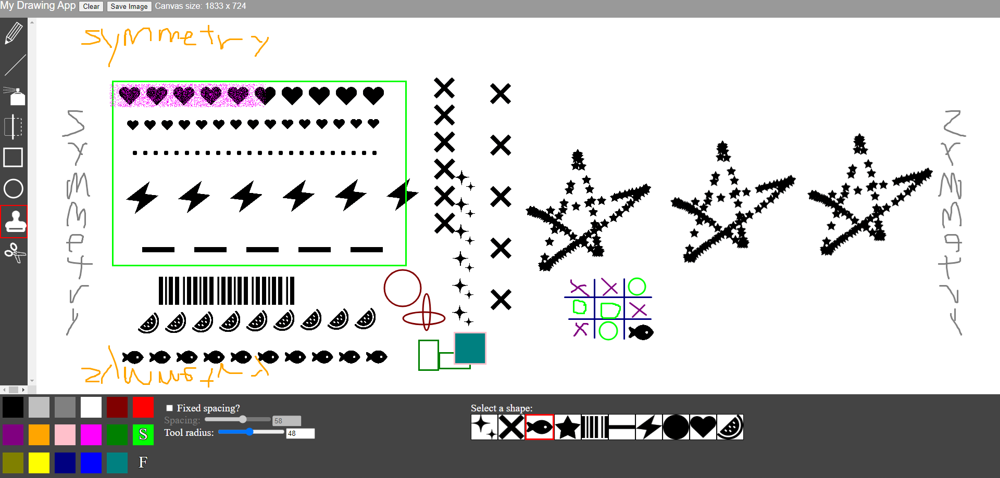

A drawing app you can use in browser. Currently only runs by hitting Live Server in VSCode. Powered by [p5js](https://github.com/processing/p5.js).
I thought I did pretty well for the assignment which was to make an improved drawing app from a given code template but I got a nasty 65% so I'm taking revenge by making this repo public (I probably deserved it though).

# Modifications and extensions to original code base
## Alternate drawing mode
I added an alternate drawing mode for each tool. They allow for the user to draw in straight lines or in a certain fixed alignment by holding the shift button while drawing. I made use of math to distribute each instance of the image accordingly.
## Scissors tool
In the original code, you could select multiple areas at once before cutting, which would result in the selection boxes being stuck on the canvas after cutting. I modified it such that the selection boxes would disappear once the mouse is released, and the canvas would remain as it is. I also moved scissors tool to its own function instead of leaving its contents inside sketch.js as globally accessible variables and functions. Cutting and pasting buttons were also made to light up or be disabled, depending on whether each function was ready. This was purely for UI.
- Alternate mode allows the user to draw strictly a square selection.
## Stamp tool
### Original function
Slider for ‘number of stars’ and placement of stamped image was completely random.
### Renewed functions
- Replaced with a fixed density slider. Technically I should have kept both.
-	Stamp tool has the alternate mode that allows the user to stamp in a straight line. The properties of the stamped images within the straight line may be optimised using the Spacing and Tool Radius sliders.
-	There are now 10 default stamp images to choose from. Each image has been loaded asynchronously with the preload process.
## Spray can tool
The only tool with a dedicated density slider. 
## Mirror tool
Changed such that the line of symmetry can be rotated in 2 ways, and the line was made into an HTML element instead of being embedded in the pixel array so that it doesn’t save the dotted lines on the canvas and allows for undoing and redoing.
## Keyboard press
Density, tool radius, spacing etc. values can all be increased and decreased using ‘[‘ and ‘]’ keys on the keyboard, as per raster software convention (e.g. Photoshop, Clip Studio Paint).
## Undoing and redoing
Stack data structure. Not much to say.
# Known bugs:
- LMB and RMB not working as intended on colour selection.
